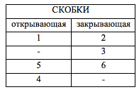

# Методы программирования 2: Стек


## Введение

Лабораторная работа направлена на практическое освоение динамической структуры данных **Стек**.  
В качестве области приложений выбрана тема вычисления арифметических выражений, возникающей при трансляции программ на языке программирования высокого уровня в исполняемые программы.

При вычислении произвольных арифметических выражений возникают две основные задачи: 
проверка корректности введённого выражения и выполнение операций в порядке, определяемом их приоритетами и расстановкой скобок. 
Существует алгоритм, позволяющий реализовать вычисление произвольного арифметического выражения за один просмотр без хранения промежуточных результатов. 
Для реализации данного алгоритма выражение должно быть представлено в постфиксной форме. Рассматриваемые в данной лабораторной работе алгоритмы являются 
начальным введением в область машинных вычислений.


## Цели и задачи

В рамках лабораторной работы ставится задача разработки стека, основанного на использовании динамической структуры (класс `TStack`).

С помощью разработанных стеков необходимо написать приложение, которое вычисляет арифметическое выражение, заданное в виде строки и вводится пользователем. 
Сложность выражения ограничена только длиной строки.

В процессе выполнения лабораторной работы требуется использовать систему контроля версий [Git][git] и фрэймворк для разработки автоматических тестов [Google Test][gtest].

Перед выполнением работы студенты получают данный проект-шаблон, содержащий следующее:

 - Интерфейсы классов `TDataCom` и `TDataRoot` (h-файлы)
 - Заготовка заголовочного файла для класса `TFormula`
 - Тестовый пример использования класса `TStack`

Выполнение работы предполагает решение следующих задач:

  1. Реализация методов класса `TDataRoot` согласно заданному интерфейсу.
  1. Разработка класса `TStack`, являющегося производным классом от `TDataRoot`.
  1. Разработка тестов для проверки работоспособности стеков.
  2. Реализация алгоритма проверки правильности введенного арифметического выражения.
  2. Реализация алгоритмов разбора и вычисления арифметического выражения.
  1. Обеспечение работоспособности тестов и примера использования.

## Общая структура проекта

Структура проекта:

  - `gtest` — библиотека Google Test.
  - `include` — директория для размещения заголовочных файлов.
  - `samples` — директория для размещения тестового приложения.
  - `work` - директория для хранения каталогов студентов с результатами работы.
  - `README.md` — информация о проекте, которую вы сейчас читаете.

## Понятие арифметического выражения


Арифметическое выражение - выражение, в котором операндами являются объекты, над которыми выполняются арифметические операции. Например,

```
(1+2)/(3+4*6.7)-5.3*4.4
```

При такой форме записи (называемой инфиксной, где знаки операций стоят между операндами) порядок действий определяется расстановкой скобок и приоритетом операций. Постфиксная (или обратная польская) форма записи не содержит скобок, а знаки операций следуют после соответствующих операндов. Тогда для приведённого примера постфиксная форма будет иметь вид:

```
1 2+ 3 4 6.7*+/ 5.3 4.4* -
```

Обратная польская нотация была разработана австралийским ученым Чарльзом Хэмблином в середине 50-х годов прошлого столетия на основе польской нотации, которая была предложена в 1920 году польским математиком Яном Лукасевичем. Эта нотация лежит в основе организации вычислений для арифметических выражений. Известный ученый Эдсгер Дейкстра предложил алгоритм для перевода выражений из инфиксной в постфиксную форму. Данный алгоритм основан на использовании стека.

## Контроль над расстановкой скобок

В рамках данной лабораторной работы предлагается ограничить контроль только правильной расстановкой скобок . Таким образом, требуется проанализировать соответствие открывающих и закрывающих круглых скобок во введённом арифметическом выражении. Программа должна напечатать таблицу соответствия скобок, причем в таблице должно быть указано, для каких скобок отсутствуют парные им, а также общее количество найденных ошибок. Для идентификации скобок могут быть использованы их порядковые номера в выражении. Например, для арифметического выражения 


```
1   2      3  4       5 6
(a+b1)/2+6.5)*(4.8+sin(x)
```

должна быть напечатана таблица вида:



Прочерки в таблице обозначают отсутствие соответствующей скобки. При отсутствии обнаруженных ошибок программа должна выдать соответствующее сообщение.

## Перевод из одной формы в другую


В рамках данного задания требуется разработать алгоритм и составить программу для перевода арифметического выражения из инфиксной формы записи в постфиксную. Инфиксная форма записи характеризуется наличием знаков операций между операндами. Например,

```
(1+2)/(3+4*6.7)-5.3*4.4
```


При такой форме записи порядок действий определяется расстановкой скобок и приоритетом операций. Постфиксная форма записи не содержит скобок, а знаки операций следуют после соответствующих операндов. Тогда для приведённого примера постфиксная форма будет иметь вид:

```
1 2+ 3 4 6.7*+/ 5.3 4.4* -
```


Так как при такой записи несколько операндов могут следовать подряд, то при выводе они разделяются пробелами.
Как результат программа должна напечатать постфиксную форму выражения или выдать сообщение о невозможности построения такой формы в случае обнаружения ошибок при расстановке скобок. 


## Вычисление выражения в постфиксной форме


Для выполнения данного задания необходимо разработать алгоритм и составить программу для вычисления арифметического выражения. Программа должна напечатать результат вычисления выражения или выдать сообщение о наличии нечисловых операндов.


## Условия и ограничения


При выполнении лабораторной работы могут быть использованы следующие основные допущения:


- Можно предполагать, что арифметические выражения состоят не более чем из 255 символов.
- В качестве допустимых арифметических операций можно рассматривать только символы + (сложение), - (вычитание), * (умножение), / (деление).

## Алгоритм решения

### Проверка скобок


На вход алгоритма поступает строка символов, на выходе должна быть выдана таблица соответствия номеров открывающихся и закрывающихся скобок и общее количество ошибок. Идея алгоритма, решающего поставленную задачу, состоит в следующем.


- Выражение просматривается посимвольно слева направо. Все символы, кроме скобок, игнорируются (т.е. просто производится переход к просмотру следующего символа).
- Если очередной символ – открывающая скобка, то её порядковый номер помещается в стек.
- Если очередной символ – закрывающая скобка, то производится выталкивание из стека номера открывающей скобки и запись этого номера в паре с номером закрывающей скобки в результирующую таблицу.
- Если в этой ситуации стек оказывается пустым, то вместо номера открывающей скобки записывается 0, а счетчик ошибок увеличивается на единицу.
- Если после просмотра всего выражения стек оказывается не пустым, то выталкиваются все оставшиеся номера открывающих скобок и записываются в результирующий массив в паре с 0 на месте номера закрывающей скобки, счетчик ошибок каждый раз увеличивается на единицу.

### Перевод в постфиксную форму

Данный алгоритм основан на использовании стека.
На вход алгоритма поступает строка символов, на выходе должна быть получена строка с постфиксной формой.
Каждой операции и скобкам приписывается приоритет.

- ( - 0

- ) - 1

- +- - 2

- */ - 3


Предполагается, что входная строка содержит синтаксически правильное выражение.


Входная строка просматривается посимвольно слева направо до достижения конца строки. Операндами будем считать любую последовательность символов входной строки, не совпадающую со знаками определённых в таблице операций. Операнды по мере их появления переписываются в выходную строку. При появлении во входной строке операции, происходит вычисление приоритета данной операции. Знак данной операции помещается в стек, если:

- Приоритет операции равен 0 (это « ( » ),
- Приоритет операции строго больше приоритета операции, лежащей на вершине стека,
- Стек пуст.

В противном случае из стека извлекаются все знаки операций с приоритетом больше или равным приоритету текущей операции. Они переписываются в выходную строку, после чего знак текущей операции помещается в стек.
Имеется особенность в обработке закрывающей скобки. Появление закрывающей скобки во входной строке приводит к выталкиванию и записи в выходную строку всех знаков операций до появления открывающей скобки. Открывающая скобка из стека выталкивается, но в выходную строку не записывается. Таким образом, ни открывающая, ни закрывающая скобки в выходную строку не попадают.
После просмотра всей входной строки происходит последовательное извлечение всех элементов стека с одновременной записью знаков операций, извлекаемых из стека, в выходную строку.

### Вычисление


Алгоритм вычисления арифметического выражения за один просмотр входной строки основан на использовании постфиксной формы записи выражения и работы со стеком

Выражение просматривается посимвольно слева направо. При обнаружении операнда производится перевод его в числовую форму и помещение в стек (если операнд не является числом, то вычисление прекращается с выдачей сообщения об ошибке.) При обнаружении знака операции происходит извлечение из стека двух значений, которые рассматриваются как операнд2 и операнд1 соответственно, и над ними производится обрабатываемая операция. Результат этой операции помещается в стек. По окончании просмотра всего выражения из стека извлекается окончательный результат.


## Результаты работы

В результате выполнения работы должны быть подготовлены следующие файлы:

- **tdatacom.h**  
- **tdataroot.h**
- **tstack.h**      - заголовочный файл класса  `TStack`.
- **tstack.cpp**    - файл с реализацией класса `TStack`.
- **tformula.h**    - заголовочный файл класса  `TFormula`.
- **tformula.cpp**  - файл с реализацией класса `TFormula`.
- **main.cpp**      - демонстрационный файл работы со стеком
- **tests.cpp**     - файл с тестами
- **test_main.cpp** - главный файл для тестирования


